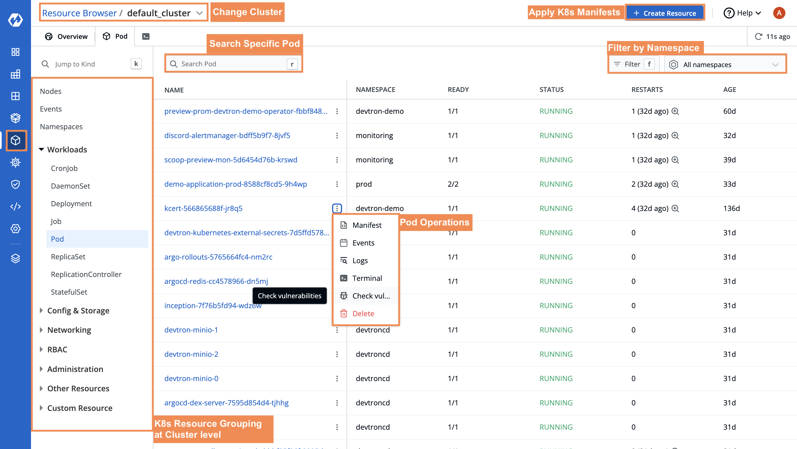

<p align="center">
<picture>
  <source media="(prefers-color-scheme: dark)"  srcset="./assets/devtron-darkmode-logo.png">
  <source media="(prefers-color-scheme: light)"  srcset="./assets/devtron-lightmode-logo.png">
  
</picture>
<h1 align= "center">Cloud Native tool integration platform for Kubernetes</h1>
</p>
 
<p align="center">
<br>
<a href="https://docs.devtron.ai/" rel="nofollow"><strong>«Explore Documentation»</strong></a> <strong>||</strong>
<a href="https://preview.devtron.ai/dashboard/" rel="nofollow"><strong>«Try Devtron Demo»</strong></a>
<br>
<a href="https://devtron.ai/">Website</a>
·
<a href="https://devtron.ai/blog/">Blogs</a>
·
<a href="https://discord.gg/jsRG5qx2gp">Join Discord channel</a>
·
<a href="https://twitter.com/DevtronL">Twitter</a>
.
<a href="https://www.youtube.com/channel/UCAHRp9qp0z1y9MMtQlcFtcw">YouTube</a>
 

</p>
<p align="center">
<a href="https://discord.gg/jsRG5qx2gp"></a>
<a href="https://goreportcard.com/badge/github.com/devtron-labs/devtron"></a>
<a href="./LICENSE"></a>
<a href="./CONTRIBUTING.md"></a>
<a href="https://github.com/devtron-labs/devtron"></a>
<a href="https://bestpractices.coreinfrastructure.org/projects/4411"></a>
<a href="http://golang.org"></a>
<a href="http://devtron.ai/"></a>
<a href="https://github.com/devtron-labs/devtron/releases"></a>
<a href="https://twitter.com/intent/tweet?text=Devtron%20helps%20in%20simplifying%20software delivery%20workflow%20for%20Kubernetes,%20check%20it%20out!!%20&hashtags=OpenSource,Kubernetes,DevOps,CICD,go&url=https://github.com/devtron-labs/devtron%0a"></a>

<p align="center">
<a href="https://devtron.ai/devops-in-a-box.html">🔥 Want to accelerate K8s adoption? Introducing DevOps in a Box; Leave DevOps on Devtron 🔥
</a>
<br>
</p>
 
 <p align="center"></p>

<br>

# 🤔 What is Devtron? 

Devtron is an open-source platform that streamlines your Kubernetes adoption and simplifies Day 2 operations. It automates cluster management, monitoring, and security, allowing you to focus on building and scaling your applications while abstracting away the complexity. 

Built on top of your favorite open-source tools, Devtron bridges the gaps and gives you superpowers for managing your clusters.

Take a look at Devtron in action on our <a href="https://preview.devtron.ai/dashboard/" rel="nofollow">demo environment</a>. Use your GitHub credentials to gain view access to the dashboard.


## 🤩 Devtron Features

Devtron offers a variety of different features, giving you flexibility to manage your clusters as you desire. You can find some of the key features below.

- A No-Code software delivery workflow which understands the domain of Kubernetes, testing, CD, SecOps so that you don't have to write scripts
- Multi-Cluster management from a single Devtron setup
- Comprehensive DevSecOps solutions including multi-level security policy acting at global, cluster, environment, and application-level for efficient hierarchical policy management
- A single centralized dashboard to view, debug and manage all applications across multiple clusters
- Get out of the box support for various deployment metrics to measure the success of the agile process.
- Modular and easily extensible with multiple plugins for CI/CD, GitOps, Security and Monitoring

To get a more comprehensive understanding of Devtron's features, please visit the [documentation](https://docs.devtron.ai/)


## ⬇️ Installation

Before you begin, you must create a [Kubernetes cluster](https://kubernetes.io/docs/tutorials/kubernetes-basics/create-cluster/) (preferably K8s 1.16 or higher) and install [Helm](https://helm.sh/docs/intro/install/).

### 1. Install Devtron with CI/CD Integration

Run the following command to install the latest version of Devtron along with the CI/CD module:

```bash
helm repo add devtron https://helm.devtron.ai

helm install devtron devtron/devtron-operator \
--create-namespace --namespace devtroncd \
--set installer.modules={cicd}
```

### Access Devtron

**URL**: Use the following command to get the dashboard URL:

```bash
kubectl get svc -n devtroncd devtron-service -o jsonpath='{.status.loadBalancer.ingress}'
```

**Credentials**:

**UserName**:  `admin` <br>
**Password**:   Run the following command to get the admin password for Devtron version v0.6.0 and higher

```bash
kubectl -n devtroncd get secret devtron-secret -o jsonpath='{.data.ADMIN_PASSWORD}' | base64 -d
```

For Devtron version less than v0.6.0, run the following command to get the admin password:

```bash
kubectl -n devtroncd get secret devtron-secret -o jsonpath='{.data.ACD_PASSWORD}' | base64 -d
```


Please refer to the document for more information on how to [access the Devtron Dashboard](./docs/setup/install/install-devtron-with-cicd.md/#access-devtron-dashboard).

#### Installation Status

The above install command for CI/CD integration starts Devtron-operator, which takes about 20 minutes to spin up all of the Devtron microservices one by one. You can check the status of the installation with the following command:

```bash
kubectl -n devtroncd get installers installer-devtron \
-o jsonpath='{.status.sync.status}'
```

The command executes with one of the following output messages, indicating the status of the installation:

* **Downloaded**: The installer has downloaded all the manifests, and installation is in progress.
* **Applied**: The installer has successfully applied all the manifests, and the installation is complete.

### 2. Install Devtron with Helm Bundle

```bash
helm repo add devtron https://helm.devtron.ai

helm install devtron devtron/devtron-operator --create-namespace --namespace devtroncd

```

### Install Multi-Architecture Nodes (ARM and AMD)

To install Devtron on clusters with the multi-architecture nodes (ARM and AMD), append the Devtron installation command with ```--set installer.arch=multi-arch```

## Architecture

Below is the architecture for Devtron. We use popular open-source projects within our workflow and build on top of them.

<p align="center"></p>

 
## 📖 Documentation
 
- [Main Documentation](https://docs.devtron.ai/)
- [Troubleshooting & Common FAQ](https://docs.devtron.ai/resources/devtron-troubleshoot)
- [Release Notes](https://github.com/devtron-labs/devtron/releases)
 
## :page_facing_up: Compatibility
 
### Current build
 
- Devtron uses modified version of [Argo Rollout](https://argoproj.github.io/argo-rollouts/)
- Application metrics only work for K8s version 1.16+
 
## :busts_in_silhouette: Community

To engage with our commuity, you can use the following resources
 
- [DevtronL on Twitter](https://twitter.com/DevtronL) - Get updates on Devtron's development and chat with project maintainers, contributors, and community members
- [Contributing to Devtron](./CONTRIBUTING.md) - Start here if you want to contribute to Devtron
- [Devtron Blogs](https://devtron.ai/blog/) - Get updates on Devtron's development and chat with project maintainers, contributors, and community members
- [Discord Community](https://discord.gg/jsRG5qx2gp)
- [Devtron Users](./USERS.md) - Companies already using Devtron
- [Community Contributions](./COMMUNITY_CONTRIBUTIONS.md) - Check out what the community says about Devtron
- [Code of Conduct](./CODE_OF_CONDUCT.md)

## :bug: Vulnerability Reporting
 
We at Devtron, take security and our users' trust very seriously. If you believe you have found a security issue, please report it to <b>security@devtron.ai</b>.
 
## :bookmark: License
 
Devtron is licensed under [Apache License, Version 2.0](LICENSE)
 
### Contributors:
 
We are deeply grateful to all our amazing contributors!
 
<a href="https://github.com/devtron-labs/devtron/graphs/contributors">
 
</a>
 

